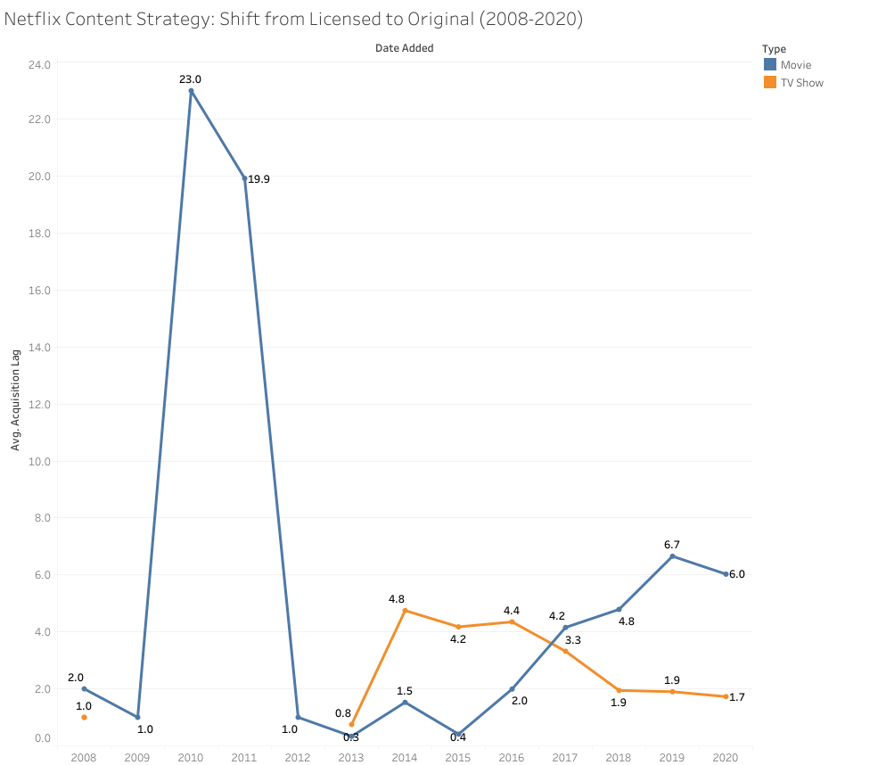
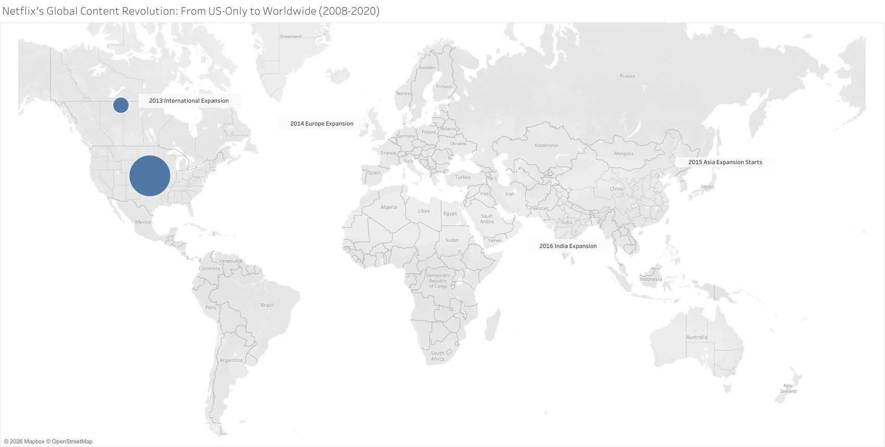
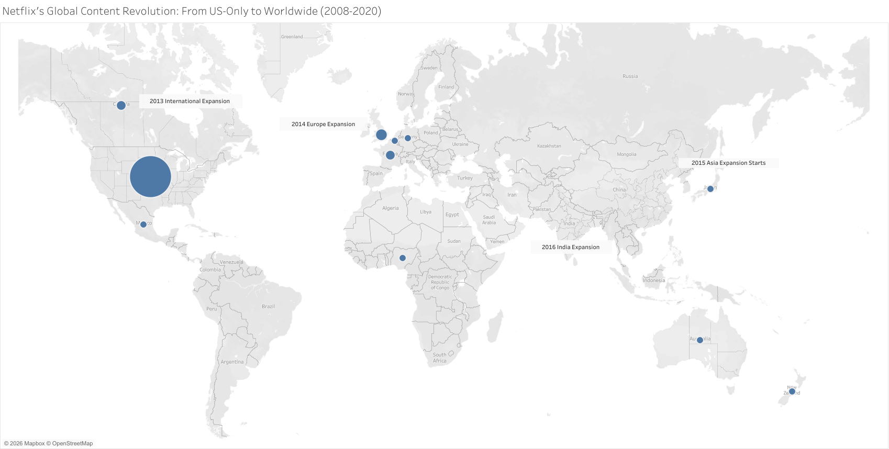
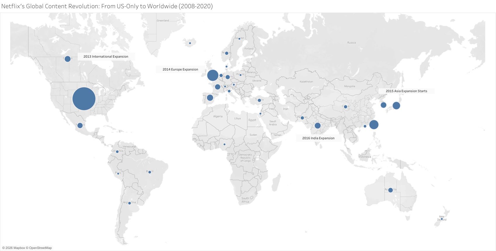
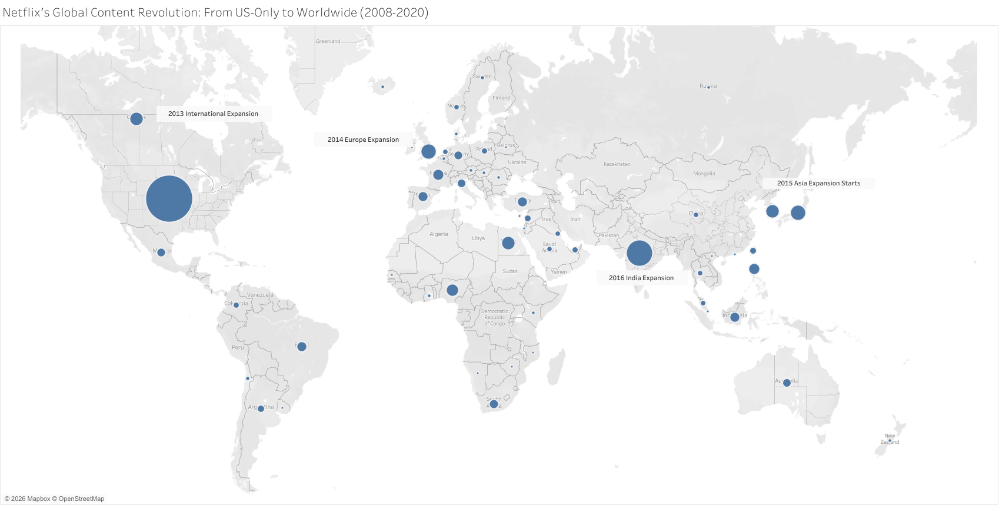
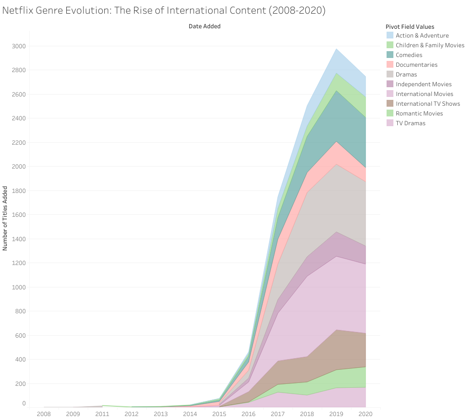
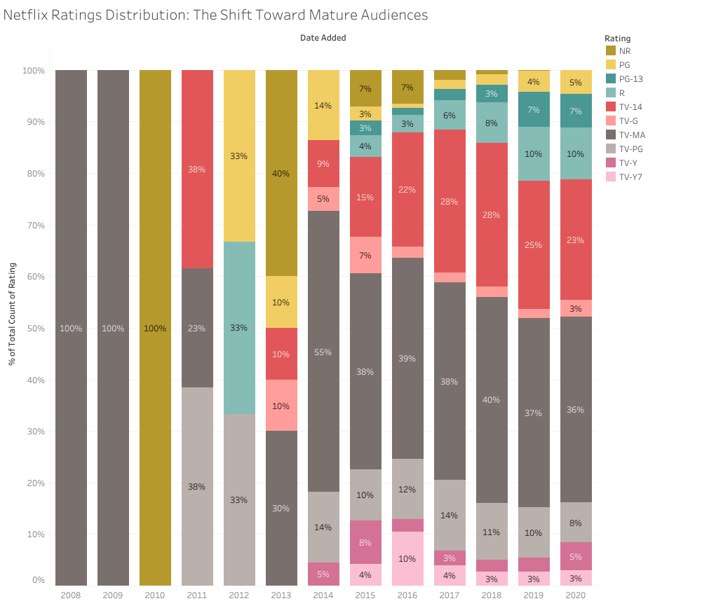

# Netflix Content Strategy Analysis (2008-2020)

An interactive Tableau analysis exploring Netflix's strategic evolution across content acquisition, global expansion, genre diversity, and audience targeting.

**[📊 View Full Interactive Dashboard on Tableau Public](https://public.tableau.com/app/profile/shreyeshi.somya/viz/NetflixContentStrategyAnalysis_17698236800650/Sheet1)**

---

## 📈 Dashboards & Insights

### 1. Content Acquisition Strategy: From Licensed to Original

**Question:** How did Netflix transition from licensing existing content to producing originals?

**Key Findings:**
- In 2010, Netflix was adding content that was 23 years old on average - primarily licensing back-catalog films
- By 2013-2014, the acquisition lag dropped dramatically to under 1 year for TV shows, indicating a shift to original series
- Movies maintained a 6-7 year lag through 2018-2020, suggesting Netflix continued licensing recent films while focusing original production on TV

**Insight:** Netflix's "originals-first" strategy became evident around 2014-2016, particularly for TV content, transforming them from a distribution platform to a content creator.

---

### 2. Global Expansion: Netflix Goes Worldwide

**Question:** When and how did Netflix expand from a US-centric service to a global content platform?

**Timeline Progression:**

**2008 - Pure US Content:**

*Netflix operates exclusively with American content - the massive circle over the US tells the entire story.*

**2013 - Testing International Waters:**

*First tentative step: Canada receives content. Netflix tests English-speaking markets first.*

**2015 - Global Expansion Launches:**

*The strategic shift begins: UK, France, Spain, Germany across Europe; Japan, South Korea, Australia in Asia-Pacific; Mexico and Brazil in Latin America. Netflix simultaneously enters multiple markets, establishing a global footprint.*

**2016 - The Inflection Point:**

*Explosive growth: India emerges as a major hub (large circle), Turkey and Pakistan enter the mix, South Korea and Japan circles grow substantially. Netflix's "global original content" strategy becomes reality - dozens of countries now producing content.*

**2020 - Truly Worldwide:**

*Mature global platform: Content contributions from 50+ countries, with India, UK, South Korea, and Japan as major hubs alongside the US. The map shows Netflix achieved its goal of being a local content producer in nearly every market.*

**Key Insight:** The 2015-2016 period represents Netflix's strategic transformation from "American streaming service available internationally" to "global entertainment platform with localized content production." This two-year window saw them enter dozens of markets simultaneously and begin commissioning local original content - fundamentally changing their competitive position against traditional media companies.

---

### 3. Genre Evolution: The Rise of International Content

**Question:** How has Netflix's content mix changed over time?

**Key Findings:**
- International Movies became the single largest category, peaking at 670+ additions in 2019
- Traditional genres (Dramas, Comedies) grew but were eclipsed by international content categories
- The 2015-2019 period saw explosive growth across all genres, followed by a strategic slowdown in 2020

**Insight:** Netflix's genre strategy mirrors their geographic expansion - as they entered new markets, local content production became their competitive advantage.

---

### 4. Ratings Distribution: Targeting Mature Audiences

**Question:** What audience demographics does Netflix prioritize?

**Key Findings:**
- TV-MA (mature audiences) consistently represents 35-55% of all content additions
- TV-14 content is the second priority at 20-40%
- Family-friendly content (TV-PG) declined from 38% (2011) to just 8% (2019)
- Combined, TV-MA and TV-14 content represents ~70% of Netflix's catalog by 2020

**Insight:** Netflix clearly targets adult audiences, with mature content dominating their production strategy. This likely reflects both viewing patterns and competition with family-oriented platforms like Disney+.

---

## 🛠️ Technical Skills Demonstrated

- **Data Transformation:** Split comma-separated genre fields, pivoted columns for analysis
- **Calculated Fields:** Created custom "Acquisition Lag" metric to measure content freshness
- **Interactive Filters:** Year sliders and geographic filters for exploratory analysis
- **Visualization Types:** Stacked area charts, geographic maps, percentage stacked bars, line charts
- **Storytelling:** Structured analysis around business questions with clear insights

## 📊 Tools Used

- **Tableau Public** - Data visualization and dashboard creation
- **Excel/CSV** - Data cleaning and transformation

## 📁 Data Source

Dataset: [Netflix Movies and TV Shows on Kaggle](https://www.kaggle.com/datasets/shivamb/netflix-shows)
- 7,787 titles
- Data through 2020

---

## 💡 Business Implications

This analysis reveals Netflix's three-phase strategic evolution:

1. **2008-2014:** Distribution platform focusing on licensing content
2. **2015-2016:** Global expansion and original content experimentation  
3. **2017-2020:** Mature global content producer prioritizing international originals and adult audiences

These insights could inform content strategy decisions, market entry analysis, or competitive positioning in the streaming industry.

---

**Created by [Shreyeshi Somya]** | [LinkedIn](https://www.linkedin.com/in/sshreyeshi/)
